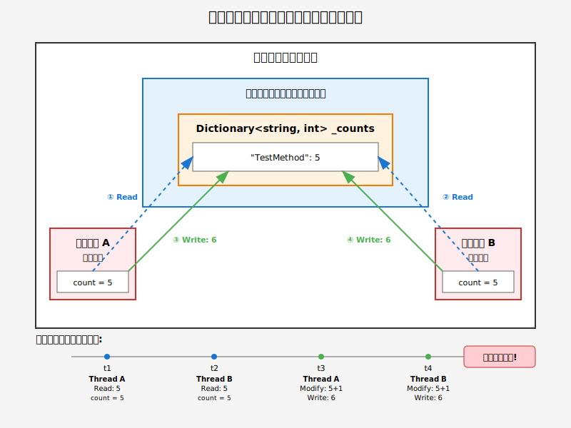

---

# Task.Run() とThreadPoolの関係

## Task.Run() の動作メカニズム

```cs
// Task.Run() の使用
Task.Run(() => 
{
    // この処理はThreadPoolのスレッドで実行される
    Console.WriteLine($"Thread ID: {Thread.CurrentThread.ManagedThreadId}");
    Console.WriteLine($"Is ThreadPool: {Thread.CurrentThread.IsThreadPoolThread}"); // True
});

// 直接Threadを作成する場合との比較
var thread = new Thread(() => 
{
    // 新規に作成された専用スレッドで実行
    Console.WriteLine($"Is ThreadPool: {Thread.CurrentThread.IsThreadPoolThread}"); // False
});
thread.Start();
```

## ThreadPoolの利点

| 特性 | ThreadPool (Task.Run) | 新規Thread |
|:-----|:---------------------|:-----------|
| スレッド作成コスト | 低（再利用） | 高（毎回作成） |
| メモリ使用量 | 効率的 | スレッドごとに1MB |
| 適用場面 | 短時間の並列処理 | 長時間の専用処理 |

---
marp: true
theme: gaia
paginate: true
html: true
style: |
  section {
    font-family: 'Noto Sans JP', sans-serif;
    font-size: 24px;
  }
  section h1 {
    font-size: 1.8rem;
  }
  section h2 {
    font-size: 1.4rem;
  }
  section h3 {
    font-size: 1.2rem;
  }
  section.lead h1 {
    text-align: center;
    font-size: 2.2rem;
  }
  section.lead h3 {
    text-align: center;
    font-size: 1.1rem;
    color: #666;
  }
  code {
    font-size: 0.85em;
  }
  pre {
    font-size: 0.8em;
    line-height: 1.3;
  }
  table {
    margin: 0 auto;
    font-size: 0.85em;
  }
  table th, table td {
    padding: 6px 10px;
  }
  .highlight {
    background-color: #ffeb3b;
    padding: 2px 4px;
    border-radius: 3px;
  }
  .danger {
    color: #f44336;
    font-weight: bold;
  }
  .success {
    color: #4caf50;
    font-weight: bold;
  }
  .warning {
    color: #ff9800;
    font-weight: bold;
  }
  .small {
    font-size: 0.8em;
  }
  .smaller {
    font-size: 0.7em;
  }
---

<!-- _class: lead -->

# マルチスレッドカウンター実装

### 正確性とパフォーマンスのトレードオフ分析

<br>

**発表者：toutou**

<br>

---

# 概要

## 本発表の目的

マルチスレッド環境におけるカウンター実装の課題と解決策を検討する

## 対象システムの要件

- 秒間数千回のメソッド呼び出し
- 複数スレッドからの同時アクセス
- システム負荷の監視指標として使用

## 検討する実装方式

1. 非スレッドセーフ実装
2. ロックベース実装
3. ロックフリー実装

---

# 1. 非スレッドセーフ実装

<style scoped>
pre { font-size: 0.7em; }
</style>

```cs
public class MethodCounter_NotThreadSafe : IMethodCounter
{
    private Dictionary<string, int> _counts = new();

    public void Record(string methodName)
    {
        if (_counts.ContainsKey(methodName))
            _counts[methodName]++;  // 非アトミック操作
        else
            _counts[methodName] = 1;
    }

    public Dictionary<string, int> GetCountsAndReset()
    {
        var result = _counts;
        _counts = new Dictionary<string, int>();  // 参照の切り替え
        return result;
    }
}
```

### 問題点
- インクリメント操作の非アトミック性
- Dictionary内部構造の破損リスク

---

# 非スレッドセーフ実装の検証

<style scoped>
pre { font-size: 0.7em; }
</style>

```cs
static async Task Step1_ShowNotThreadSafe()
{
    // メモリ状態の初期化
    GC.Collect();
    GC.WaitForPendingFinalizers();
    await Task.Delay(200);

    var counter = new MethodCounter_NotThreadSafe();
    long exceptionCount = 0;

    // 100タスクをThreadPoolで同時実行
    var tasks = Enumerable.Range(0, ThreadCount).Select(_ => Task.Run(() =>
    {
        for (int i = 0; i < CallsPerThread; i++)
        {
            try
            {
                counter.Record("TestMethod");
            }
            catch
            {
                Interlocked.Increment(ref exceptionCount);
            }
        }
    }));

    await Task.WhenAll(tasks);

    Console.WriteLine($"  -> 期待値: {TotalCalls:N0}");
    Console.WriteLine($"  -> 実測値: {counter.GetCountsAndReset()["TestMethod"]:N0}");
    Console.WriteLine($"  -> 例外発生数: {exceptionCount:N0}");
}
```

## Task.Run() について
- **ThreadPoolのスレッドを使用**: 新規スレッド作成ではなく、既存のスレッドを再利用
- **効率的なリソース管理**: スレッドの作成・破棄のオーバーヘッドを削減
```

---

# 検証結果：データ不整合

## テスト条件
- スレッド数：100
- 各スレッドの呼び出し回数：10,000
- 総呼び出し数：1,000,000


## 発生した問題
- カウント値の不整合
- Dictionaryの内部構造破損による例外

---

# 問題の原因分析

## メモリ構造と競合状態



### 技術的課題

1. **共有データへの非同期アクセス**
   - 全スレッドがヒープ上の単一Dictionaryオブジェクトを共有
   - 保護機構なしで同時読み書き

2. **Read-Modify-Write操作の非アトミック性**
   - `_counts[methodName]++`は3つの個別操作
   - 操作間での割り込み発生によるカウント消失

---

# CPUキャッシュによる可視性問題


## 発生メカニズム

1. **キャッシュコヒーレンシの欠如**
   - 各CPUコアが独自のL1キャッシュを保持
   - メインメモリへの書き戻しタイミング未保証

2. **Dictionary内部構造の破損**
   - 複数スレッドによる同時構造変更
   - 予期しないメモリアクセスによる例外発生

---

# 2. ロックベース実装

<style scoped>
pre { font-size: 0.65em; }
h3,li {font-size:0.7em;}
</style>

```cs
public class MethodCounter_WithLock : IMethodCounter
{
    private readonly object _lock = new();
    private Dictionary<string, int> _counts = new();

    public void Record(string methodName)
    {
        lock (_lock)  // 相互排他制御
        {
            if (_counts.ContainsKey(methodName))
                _counts[methodName]++;
            else
                _counts[methodName] = 1;
        }
    }

    public Dictionary<string, int> GetCountsAndReset()
    {
        lock (_lock)  // 読み取り操作も保護
        {
            var result = _counts;
            _counts = new Dictionary<string, int>();
            return result;
        }
    }
}
```

### 実装の特徴
- Monitorクラスによる相互排他
- 完全なメモリバリア
- 例外安全性の保証

---

# ロックベース実装の検証

<style scoped>
pre { font-size: 0.7em; }
h3,li { font-size: 0.8em; }
</style>

```cs
static async Task Step2_ShowWithLock()
{
    // メモリ状態の初期化
    GC.Collect();
    GC.WaitForPendingFinalizers();
    await Task.Delay(200);

    var counter = new MethodCounter_WithLock();

    // 100スレッドで同時実行（例外処理不要）
    var tasks = Enumerable.Range(0, ThreadCount).Select(_ => Task.Run(() =>
    {
        for (int i = 0; i < CallsPerThread; i++)
        {
            counter.Record("TestMethod");
        }
    }));

    await Task.WhenAll(tasks);

    Console.WriteLine($"  -> 期待値: {TotalCalls:N0}");
    Console.WriteLine($"  -> 実測値: {counter.GetCountsAndReset()["TestMethod"]:N0}");
}
```

### 検証ポイント
- データの整合性
- 例外の発生有無
- 処理完了の確実性

---

# ロックベース実装の結果


## 達成事項
- カウント値の完全な一致
- 例外の発生なし
- データ整合性の保証

## 懸念事項
- スレッド競合によるパフォーマンス低下の可能性

---

# Monitorクラスの内部動作

## lockステートメントの展開

```cs
// 高レベル構文
lock (_lock) { /* クリティカルセクション */ }

// 実際の実装
bool lockTaken = false;
try
{
    Monitor.Enter(_lock, ref lockTaken);
    // クリティカルセクション
}
finally
{
    if (lockTaken) Monitor.Exit(_lock);
}
```

## 重要な特性
- **待機キュー管理**: ブロックされたスレッドの管理
- **公平性**: FIFOではない実装
- **再入可能性**: 同一スレッドからの再取得可能

---

# 3. ロックフリー実装

<style scoped>
pre { font-size: 0.7em; }
</style>

```cs
public class MethodCounter_LockFree : IMethodCounter
{
    private ConcurrentQueue<string> _events = new();
    
    public void Record(string methodName)
    {
        _events.Enqueue(methodName);  // ロックフリー操作
    }
    
    public Dictionary<string, int> GetCountsAndReset()
    {
        // アトミックな参照交換
        var currentQueue = Interlocked.Exchange(
            ref _events, new ConcurrentQueue<string>()
        );
        
        // 集計処理（スレッドローカル）
        var counts = new Dictionary<string, int>();
        while (currentQueue.TryDequeue(out var methodName))
        {
            if (counts.ContainsKey(methodName))
                counts[methodName]++;
            else
                counts[methodName] = 1;
        }
        return counts;
    }
}
```

---

# ConcurrentQueueの内部実装 (1/2)

## アーキテクチャ

1. **セグメントベース構造**
   - 動的に拡張可能なセグメント連結リスト
   - 各セグメントは固定長配列

2. **CAS（Compare-And-Swap）操作**
   ```cs
   // アトミック更新の基本操作
   Interlocked.CompareExchange(ref location, newValue, comparand)
   ```

## 利点
- ロック取得のオーバーヘッドなし
- 高い並行性の実現

---

# ConcurrentQueueの内部実装 (2/2)

## パフォーマンス最適化

3. **適応的待機戦略**
   - 短期競合：スピンウェイト
   - 長期競合：Thread.Yield() / Sleep(0)

4. **False Sharing対策**
   - キャッシュライン境界を考慮したパディング
   - CPUキャッシュの効率的利用

## 結果
- 高スループットの実現
- スケーラブルな並行処理

---

# パフォーマンス比較


## 測定結果の分析

### パフォーマンス向上の要因
- ロック競合の排除
- CPUキャッシュの効率的利用
- 待機時間の最小化

---

# ロックフリー実装の課題

## 同時読み書きシナリオでの問題


## 観測された現象
- 書き込み総数と読み取り総数の不一致
- データロストの発生

---

# Interlocked.Exchangeの動作原理 (1/2)

## CPU命令レベルの実装

### x86/x64アーキテクチャ
```asm
; XCHG命令 - アトミック交換
LOCK XCHG [memory], register
```

### アトミック性の保証
- 単一CPU命令での実行
- ハードウェアレベルでの割り込み不可
- マルチコア環境での一貫性保証

---

# Interlocked.Exchangeの動作原理 (2/2)

## メモリモデルへの影響

1. **メモリバリア**
   - Full Fenceの自動適用
   - 命令の並び替え防止

2. **キャッシュコヒーレンシ**
   - 全CPUコアでの即座の可視化
   - MSIプロトコルによる一貫性

3. **パフォーマンス特性**
   - ロックより低レイテンシ
   - 高い並行性

```cs
// 使用例
var oldValue = Interlocked.Exchange(ref _events, newQueue);
// oldValueには交換前の値が確実に格納される
```

---

# データロストのメカニズム

## 競合状態の詳細分析

<style scoped>
table { font-size: 0.75em; }
td { padding: 6px; font-size: 0.85em; }
</style>

<div style="font-size: 0.9em">

| 時刻 | 書込スレッド | 読出スレッド |
|:-----|:-------------|:-------------|
| **t1** | Queue1の参照を取得 | 待機中 |
| **t2** | <span class="warning">コンテキストスイッチ</span> | 待機中 |
| **t3** | 停止中 | Exchange実行<br>Queue1→Queue2 |
| **t4** | <span class="warning">実行再開</span> | Queue1を集計中 |
| **t5** | <span class="danger">Queue1へ書き込み</span> | Queue1を集計完了 |

</div>

<br>

### 結果
Queue1への書き込みデータが永続的に失われる

---

# メモリモデルと可視性

## CPUキャッシュの課題

### キャッシュコヒーレンシ問題
```cs
// Thread 1 (CPU1)
_flag = true;  // L1キャッシュに書き込み

// Thread 2 (CPU2)
if (_flag)     // L1キャッシュから読み込み（古い値の可能性）
```

### volatileキーワードの役割
```cs
private volatile bool _flag;  // メインメモリへの直接アクセス
```

### メモリバリアの種類
- **Read Barrier**: 読み込み順序の保証
- **Write Barrier**: 書き込み順序の保証
- **Full Barrier**: 両方向の順序保証

**注意**: volatileは順序のみ保証、アトミック性は保証しない

---

# 非同期プログラミングでの実装

## Channel APIを使用したアプローチ

```cs
public class AsyncMethodCounter
{
    private readonly Channel<string> _events = 
        Channel.CreateUnbounded<string>();
    
    public async ValueTask RecordAsync(string methodName)
    {
        await _events.Writer.WriteAsync(methodName);
    }
    
    public async Task<Dictionary<string, int>> GetCountsAsync()
    {
        var counts = new Dictionary<string, int>();
        await foreach (var name in _events.Reader.ReadAllAsync())
        {
            counts[name] = counts.GetValueOrDefault(name) + 1;
        }
        return counts;
    }
}
```

## 利点
- スレッドブロッキングの回避
- バックプレッシャー制御
- 高いスケーラビリティ

---

# 実装方式の比較

<style scoped>
table { 
  font-size: 1.0em;
  width: 95%;
}
th, td { 
  padding: 8px;
  text-align: center;
  font-size: 1.0em;
}
</style>

<br>
<br>

| 実装方式 | 正確性 | 性能 | 適用場面 |
|:---------|:------:|:----:|:--------|
| **非スレッドセーフ** | 不可 | － | 使用禁止 |
| **ロックベース** | 完全 | 中 | 正確性重視<br><span class="small">（金融取引、在庫管理）</span> |
| **ロックフリー** | 条件付き | 高 | 性能重視<br><span class="small">（ログ収集、統計情報）</span> |

<br>

---

# 同期プリミティブ一覧 (1/2)

## 基本プリミティブ

| プリミティブ | 用途 | 特徴 |
|:------------|:-----|:-----|
| **lock** | 汎用相互排他 | シンプル、再入可能 |
| **ReaderWriterLockSlim** | 読み取り多数 | 複数読み取り、単一書き込み |
| **SemaphoreSlim** | リソース数制限 | カウンティングセマフォ |

## 選択基準
- 読み書き比率が7:1以上：ReaderWriterLockSlim
- 一般的な排他制御：lock
- 同時実行数の制限：SemaphoreSlim

---

# 同期プリミティブ一覧 (2/2)

## 特殊用途プリミティブ

| プリミティブ | 用途 | 特徴 |
|:------------|:-----|:-----|
| **Barrier** | フェーズ同期 | 全スレッド同期点 |
| **CountdownEvent** | 完了待機 | 複数タスク完了待ち |

## 実装戦略
1. 初期実装はlockを使用
2. プロファイリングによるボトルネック特定
3. 必要に応じて高度なプリミティブへ移行

---

# 実装例：Webアプリケーション

<style scoped>
pre { font-size: 0.55em; }
</style>

```cs
public class MetricsService
{
    private readonly IMethodCounter _counter;
    
    public MetricsService(IConfiguration config)
    {
        // 設定に基づく実装選択
        _counter = config.GetValue<bool>("UseHighPerformanceCounter")
            ? new MethodCounter_LockFree()
            : new MethodCounter_WithLock();
    }
    
    // APIエンドポイント呼び出しの記録
    public void RecordApiCall(string endpoint)
    {
        _counter.Record($"API:{endpoint}");
    }
    
    // 定期的なメトリクス収集
    public async Task CollectMetricsAsync()
    {
        while (true)
        {
            await Task.Delay(TimeSpan.FromSeconds(60));
            var metrics = _counter.GetCountsAndReset();
            
            // モニタリングサービスへの送信
            foreach (var (method, count) in metrics)
            {
                _logger.LogInformation($"{method}: {count} calls/min");
            }
        }
    }
}
```

---

# パフォーマンステスト実装

<style scoped>
pre { font-size: 0.45em; }
</style>

```cs
static async Task Step3_ComparePerformance()
{
    const int durationSeconds = 3;

    // ロックベース実装のテスト
    GC.Collect();
    GC.WaitForPendingFinalizers();
    await Task.Delay(200);

    var lockCounter = new MethodCounter_WithLock();
    long lockWrites = await RunWriteOnlyTest(lockCounter, durationSeconds);
    Console.WriteLine($"  -> Lock版:      {lockWrites / durationSeconds,15:N0} 件/秒");

    // ロックフリー実装のテスト
    GC.Collect();
    GC.WaitForPendingFinalizers();
    await Task.Delay(200);

    var lockFreeCounter = new MethodCounter_LockFree();
    long lockFreeWrites = await RunWriteOnlyTest(lockFreeCounter, durationSeconds);
    Console.WriteLine($"  -> Lock-free版: {lockFreeWrites / durationSeconds,15:N0} 件/秒");

    double speedup = (double)lockFreeWrites / lockWrites;
    Console.WriteLine($"\n  パフォーマンス向上率: {speedup:F2}倍");
}

static async Task<long> RunWriteOnlyTest(IMethodCounter counter, int durationSeconds)
{
    long totalWritten = 0;
    var cts = new CancellationTokenSource();
    var keys = Enumerable.Range(0, 100).Select(i => $"Method_{i}").ToArray();
    
    var writerTasks = Enumerable.Range(0, 100)
        .Select(threadIndex => Task.Run(() =>
        {
            var random = new Random(threadIndex);
            while (!cts.IsCancellationRequested)
            {
                counter.Record(keys[random.Next(keys.Length)]);
                Interlocked.Increment(ref totalWritten);
            }
        })).ToList();
    
    await Task.Delay(TimeSpan.FromSeconds(durationSeconds));
    cts.Cancel();
    await Task.WhenAll(writerTasks);
    return totalWritten;
}
```

---

# データロスト検証実装

<style scoped>
pre { font-size: 0.45em; }
</style>

```cs
static async Task Step4_ShowLockFreeDataLoss()
{
    GC.Collect();
    GC.WaitForPendingFinalizers();
    await Task.Delay(200);

    var counter = new MethodCounter_LockFree();
    long totalWritten = 0;
    long totalRead = 0;
    var cts = new CancellationTokenSource();

    // 100スレッドによる継続的書き込み
    var writerTasks = Enumerable.Range(0, ThreadCount).Select(_ => Task.Run(() =>
    {
        while (!cts.IsCancellationRequested)
        {
            counter.Record("Event");
            Interlocked.Increment(ref totalWritten);
        }
    })).ToList();

    // 定期的な読み取り
    var readerTask = Task.Run(async () =>
    {
        while (!cts.IsCancellationRequested)
        {
            var c = counter.GetCountsAndReset();
            Interlocked.Add(ref totalRead, c.Values.Sum());
            await Task.Delay(2);
        }
    });

    await Task.Delay(5000);
    cts.Cancel();
    await Task.WhenAll(writerTasks.Append(readerTask));
    
    // 残存データの回収
    totalRead += counter.GetCountsAndReset().Values.Sum();

    Console.WriteLine($"  -> 書き込み総数: {totalWritten:N0}");
    Console.WriteLine($"  -> 読み取り総数: {totalRead:N0}");
    Console.WriteLine($"  -> データロスト: {totalWritten - totalRead:N0}");
}
```

---

# BenchmarkDotNetによる性能測定

<style scoped>
pre { font-size: 0.55em; }
</style>

```cs
[MemoryDiagnoser]
[SimpleJob(RuntimeMoniker.Net80)]
public class CounterBenchmark
{
    private MethodCounter_WithLock _lockCounter;
    private MethodCounter_LockFree _lockFreeCounter;
    private string[] _methodNames;
    
    [GlobalSetup]
    public void Setup()
    {
        _lockCounter = new MethodCounter_WithLock();
        _lockFreeCounter = new MethodCounter_LockFree();
        _methodNames = Enumerable.Range(0, 100)
            .Select(i => $"Method_{i}")
            .ToArray();
    }
    
    [Benchmark(Baseline = true)]
    public void WithLock()
    {
        Parallel.For(0, 1000, i =>
        {
            _lockCounter.Record(_methodNames[i % 100]);
        });
    }
    
    [Benchmark]
    public void LockFree()
    {
        Parallel.For(0, 1000, i =>
        {
            _lockFreeCounter.Record(_methodNames[i % 100]);
        });
    }
}
```

---

# 結論

## 重要な知見

### 実装選択の指針

1. **正確性が最優先の場合**
   - ロックベース実装を選択
   - 金融取引、在庫管理などのクリティカルなシステム

2. **高スループットが要求される場合**
   - ロックフリー実装を検討
   - ログ収集、アクセス解析などの統計的用途

### 設計原則

> トレードオフを理解し、要件に適した実装を選択する

パフォーマンステストによる検証が不可欠

---

<!-- _class: lead -->

# 質疑応答

<br>

### ご質問をお待ちしています

<br>

**GitHub**: [multi-thread-demo](https://github.com/tou-tou/multi-thread-demo)
**Twitter**: [@toutou](https://twitter.com/toutou)