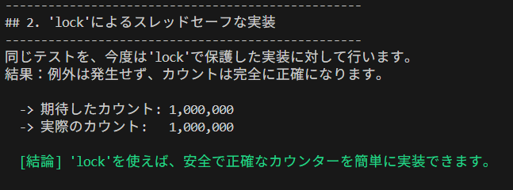
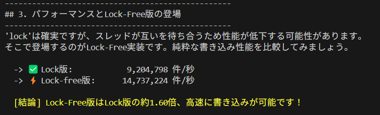
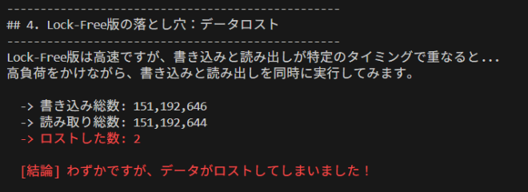

<!-- _class: lead -->

# マルチスレッドカウンター

### 性能と正確性の探求

<br>

**発表者：toutou**

<br>


<!-- 
speaker notes:
- マルチスレッド環境でのカウンター実装の課題について説明します
- 3つの実装方法を比較し、それぞれのトレードオフを解説します
-->

---

<h1 style="font-size: 1.8rem">問題提起：メソッド呼び出しを数えたい！</h1>

<div style="font-size: 0.9em">

<h2 style="font-size: 1.4rem">要件</h2>

- 高トラフィック環境（1秒間に数千回の呼び出し）
- 複数スレッドから同時アクセス
- サーバー負荷の指標として使用

</div>

<br>

<h3 style="font-size: 1.3rem">🤔 あなたならどう実装しますか？</h3>

<!-- 
speaker notes:
- まずは素朴な実装から始めてみます
- 高頻度アクセスという要件が重要なポイントです
-->

---

# シンプルな実装を試してみる

<style scoped>
pre { font-size: 0.7em; }
</style>

```cs
public class MethodCounter_NotThreadSafe : IMethodCounter
{
    private Dictionary<string, int> _counts = new();

    public void Record(string methodName)
    {
        if (_counts.ContainsKey(methodName))
            _counts[methodName]++;  // ← 危険！
        else
            _counts[methodName] = 1;
    }

    public Dictionary<string, int> GetCountsAndReset()
    {
        var result = _counts;
        _counts = new Dictionary<string, int>();  // ← ここも危険！
        return result;
    }
}
```

### ⚠️ 複数スレッドから同時アクセスすると...？


---

# 複数スレッドから同時アクセス

<style scoped>
pre { font-size: 0.5em; }
</style>

```cs
static async Task Step1_ShowNotThreadSafe()
{
    // テスト前にGCを実行し、メモリ状態をクリーンにする
    GC.Collect();
    GC.WaitForPendingFinalizers();
    await Task.Delay(200); // 安定待ち

    var counter = new MethodCounter_NotThreadSafe();
    long exceptionCount = 0;

    // 100スレッドを同時に起動
    var tasks = Enumerable.Range(0, ThreadCount).Select(_ => Task.Run(() =>
    {
        for (int i = 0; i < CallsPerThread; i++)
        {
            try
            {
                counter.Record("TestMethod");
            }
            catch
            {
                // 例外が発生したらカウント（Dictionary破損時など）
                Interlocked.Increment(ref exceptionCount);
            }
        }
    }));

    await Task.WhenAll(tasks);

    // 結果を表示
    Console.WriteLine($"  -> 期待したカウント: {TotalCalls:N0}");
    Console.WriteLine($"  -> 実際のカウント:   {counter.GetCountsAndReset()["TestMethod"]:N0}");
    Console.WriteLine($"  -> 例外の発生回数:   {exceptionCount:N0}");
}
```

---
<style scoped>
h2,h3 { font-size : 0.9em;}
li { font-size: 0.8em; }
</style>

# 結果：データが壊れる 💥

## テスト条件
- 100スレッド × 10,000回 = 合計100万回の呼び出し


---

<style scoped>
pre { font-size: 1.em; }
h2,h3 { font-size : 0.9em;}
li { font-size: 1.0em; }
</style>

# 問題の原因


```cs
public class MethodCounter_NotThreadSafe : IMethodCounter
{
    private Dictionary<string, int> _counts = new();

    public void Record(string methodName)
    {
        if (_counts.ContainsKey(methodName))
            _counts[methodName]++;  // ← アトミックではない
        else
            _counts[methodName] = 1;
    }

    public Dictionary<string, int> GetCountsAndReset()
    {
        var result = _counts;
        _counts = new Dictionary<string, int>();  // ← 別スレッドでは古い辞書を持つ可能性がある
        return result;
    }
}
```

- <span class="danger">データ不整合</span>: `++`操作はアトミックではない
- <span class="danger">例外リスク</span>: `Dictionary`の内部構造が破損する可能性

<!-- 
speaker notes:
- Read-Modify-Write操作の非アトミック性が原因
- 実際の本番環境では予期しない例外でシステムダウンも
-->


---

# 解決策1：`lock`で守る 🔒

## 相互排他による安全性の確保

<style scoped>
pre { font-size: 0.65em; }
h3,li {font-size:0.7em;}
</style>

```cs
public class MethodCounter_WithLock : IMethodCounter
{
    private readonly object _lock = new();
    private Dictionary<string, int> _counts = new();

    public void Record(string methodName)
    {
        lock (_lock) // 一度に1スレッドのみ実行
        {
            if (_counts.ContainsKey(methodName))
                _counts[methodName]++;
            else
                _counts[methodName] = 1;
        }
    }

    public Dictionary<string, int> GetCountsAndReset()
    {
        lock (_lock)  // 読み取りも保護が必要
        {
            var result = _counts;
            _counts = new Dictionary<string, int>();
            return result;
        }
    }
}
```

### ポイント
- **例外処理が不要**: lockで保護されているため、Dictionary破損は起こらない
- **カウントが正確**: 相互排他により、すべての操作が順序通りに実行される
  
---

# マルチスレッドでLock版を呼び出しテスト

<style scoped>
pre { font-size: 0.7em; }
h3,li { font-size: 0.8em; }
</style>

```cs
static async Task Step2_ShowWithLock()
{
    // テスト前にGCを実行し、メモリ状態をクリーンにする
    GC.Collect();
    GC.WaitForPendingFinalizers();
    await Task.Delay(200); // 安定待ち

    var counter = new MethodCounter_WithLock();

    // 100スレッドを同時に起動（例外処理は不要）
    var tasks = Enumerable.Range(0, ThreadCount).Select(_ => Task.Run(() =>
    {
        for (int i = 0; i < CallsPerThread; i++)
        {
            counter.Record("TestMethod");
        }
    }));

    await Task.WhenAll(tasks);

    // 結果を表示（カウントは必ず正確）
    Console.WriteLine($"  -> 期待したカウント: {TotalCalls:N0}");
    Console.WriteLine($"  -> 実際のカウント:   {counter.GetCountsAndReset()["TestMethod"]:N0}");
    
    // 結論：'lock'を使えば、安全で正確なカウンターを簡単に実装できます
}
```

- 複数スレッドで書き込み、正しくカウントされるかを確認
  
---


# `lock`版の実行結果



## 🎉 問題解決！

### ...でも、ちょっと待って

<span class="warning">スレッドの「順番待ち」がボトルネックになるのでは？</span>

<!-- 
speaker notes:
- 正確性は保証されたが、性能への影響が気になる
- 高頻度アクセスでは待機時間が累積する可能性
-->


---

# 深掘り：lock の内部動作 🔍

## Monitor クラスの仕組み

```cs
// lockステートメントの展開
lock (_lock) { /* クリティカルセクション */ }

// ↓ 実際の動作
bool lockTaken = false;
try
{
    Monitor.Enter(_lock, ref lockTaken);
    // クリティカルセクション
}
finally
{
    if (lockTaken) Monitor.Exit(_lock);
}
```

### 重要なポイント
- **待機キュー**: 取得できなかったスレッドは待機状態
- **公平性**: 待機時間順ではない
- **再入可能**: 同一スレッドは複数回ロック可能

---

# 解決策2：Lock-Free実装 ⚡

## `ConcurrentQueue<T>`を使った高速化

<style scoped>
pre { font-size: 0.7em; }
</style>

```cs
public class MethodCounter_LockFree : IMethodCounter
{
    private ConcurrentQueue<string> _events = new();
    
    public void Record(string methodName)
    {
        _events.Enqueue(methodName);  // lockなしで超高速！
    }
    
    public Dictionary<string, int> GetCountsAndReset()
    {
        // キューをアトミックに新しいものと交換
        var currentQueue = Interlocked.Exchange(
            ref _events, new ConcurrentQueue<string>()
        );
        
        // 集計処理（この時点でcurrentQueueは他スレッドから触られない）
        var counts = new Dictionary<string, int>();
        while (currentQueue.TryDequeue(out var methodName))
        {
            if (counts.ContainsKey(methodName))
                counts[methodName]++;
            else
                counts[methodName] = 1;
        }
        return counts;
    }
}
```

---

# 深掘り：ConcurrentQueue の威力 💪 (1/2)

## なぜ ConcurrentQueue は速いのか？

### 内部実装の特徴

1. **セグメント構造**
   - 動的拡張可能なセグメント連結リスト
   - 各セグメントは固定サイズ配列

2. **Compare-And-Swap (CAS) 操作**
   ```cs
   // アトミックな更新
   Interlocked.CompareExchange(ref location, newValue, comparand)
   ```

アトミックな更新操作により、ロックなしで安全な並行アクセスを実現

---

<style scoped>
section { font-size: 20px; }
/* h1 { font-size: 1.4rem; } */
h3 { font-size: 0.9rem; }
</style>

# 深掘り：ConcurrentQueue の威力 💪 (2/2)

## 高速化の秘密（続き）

3. **スピンロック + バックオフ**
   - 短時間待機：スピン（ビジーウェイト）
   - 長時間競合：Thread.Yield() / Sleep(0)

4. **false sharing 回避**
   - パディングでキャッシュライン分離
   - CPUキャッシュラインの競合を防止

### 結果
<p class="success">✨ ロックフリーで高スループット実現！</p>

**スループット向上の要因**
- CPU待機時間の削減
- メモリアクセスパターンの最適化

---


# 性能比較：驚きの結果！



### 🚀 これで速度も正確性も完璧...？

<span style="font-size: 0.8em">**高速化の要因**: ロック競合排除 + CPUキャッシュ効率向上</span>

<!-- 
speaker notes:
- Lock-free実装により大幅な性能向上を実現
- しかし、本当に完璧なのでしょうか？
-->

---

# Lock-Free版の落とし穴 😱

## 大量の書き込みと大量の読み出しを同時実行すると...



### 🤔 なぜデータが失われるのか？

高速化と引き換えに、完全性を犠牲にしているのでしょうか？

---


# 深掘り：Interlocked.Exchange の魔法 🎯 (1/2)

## CPU 命令レベルでの動作

### x86/x64 での実装
```asm
; XCHG 命令 - アトミックな交換
LOCK XCHG [memory], register
```

### なぜアトミックなのか？
- **単一CPU命令**: 割り込み不可能な操作
- **ハードウェア保証**: CPUレベルでの完全性
- **マルチコア対応**: 全コア間での同期

<span style="font-size: 0.9em">**重要**: ソフトウェアロックより根本的に安全</span>

---


# 深掘り：Interlocked.Exchange の魔法 🎯 (2/2)

## 3つの重要な特徴

1. **メモリバリア**
   - Full Fence が自動適用
   - 前後命令の並び替え防止

2. **キャッシュコヒーレンシ**
   - 全CPUコアのキャッシュ同期
   - 可視性の即座保証

3. **パフォーマンス**
   - lockより高速
   - スケーラビリティ向上

```cs
// 使用例
var oldValue = Interlocked.Exchange(ref _events, newQueue);
// oldValue には交換前の値が確実に入る
```

---

# データロストの仕組み

## 競合状態（Race Condition）の発生

<style scoped>
table { font-size: 0.75em; }
td { padding: 6px; font-size: 0.85em; }
</style>

<div style="font-size: 0.9em">

| 時刻 | 書込スレッドA | 読出スレッドB |
|:-----|:-------------|:-------------|
| **t1** | 現在のキュー(**Queue1**)の参照を取得 | (待機中) |
| **t2** | <span class="warning">スレッド切替 →</span> | (待機中) |
| **t3** | (停止中) | `Exchange`実行！<br>**Queue1**→**Queue2**に交換 |
| **t4** | <span class="warning">スレッド切替 →</span> | Queue1を集計中 |
| **t5** | <span class="danger">古いQueue1に書込！</span> | Queue1を集計中 |

</div>

<br>

### 💀 結果：Queue1への書き込みは永遠に失われる

<!-- 
speaker notes:
- ナノ秒単位のタイミングで発生する微妙な問題
- 参照の取得とEnqueue実行の間に割り込みが入ると発生
-->

---

# 深掘り：スレッド間の可視性 👁️

## メモリモデルと volatile

### CPU キャッシュの問題
```cs
// Thread 1
_flag = true;  // CPU1 キャッシュに書き込み

// Thread 2  
if (_flag)     // CPU2 キャッシュから読み込み（古い値？）
```

### volatile の役割
```cs
private volatile bool _flag;  // 常にメモリから読み書き
```

### メモリバリアの種類
- **Read Barrier**: 読み込み順序保証
- **Write Barrier**: 書き込み順序保証  
- **Full Barrier**: 両方保証（lock, Interlocked）

<p class="warning">⚠️ volatile は順序保証のみ、アトミック性は保証しない！</p>

---

# 深掘り：Task と async/await 🌟

## 非同期プログラミングでの同期

```cs
// ロックを使わない非同期カウンター
public class AsyncMethodCounter
{
    private readonly Channel<string> _events = 
        Channel.CreateUnbounded<string>();
    
    public async ValueTask RecordAsync(string methodName)
    {
        await _events.Writer.WriteAsync(methodName);
    }
    
    public async Task<Dictionary<string, int>> GetCountsAsync()
    {
        var counts = new Dictionary<string, int>();
        await foreach (var name in _events.Reader.ReadAllAsync())
        {
            counts[name] = counts.GetValueOrDefault(name) + 1;
        }
        return counts;
    }
}
```

### メリット
- スレッドをブロックしない、より高いスケーラビリティ、バックプレッシャー制御可能

---

# まとめ：3つの実装の比較

<style scoped>
table { 
  font-size: 1.0em;
  width: 95%;
}
th, td { 
  padding: 8px;
  text-align: center;
  font-size: 1.0em;
}
</style>
    
<br>
<br>
      

<!-- <div style="font-size: 1.0rem"> -->

| 実装方式 | 正確性 | 性能 | 適用場面 |
|:---------|:------:|:----:|:--------|
| **NotThreadSafe** | ❌ | － | 使用禁止 |
| **WithLock** | ✅ | ⚠️ | 正確性が最優先<br><span class="small">（課金、在庫管理）</span> |
| **LockFree** | ⚠️ | ✅ | 高速性が重要<br><span class="small">（アクセス解析、ログ）</span> |

</div>

<br>

<style scoped>
section { font-size: 20px; }
h1 { font-size: 1.4rem; }
h2 { font-size: 1.1rem; }
h3 { font-size: 0.9rem; }
table { font-size: 0.75em; }
</style>

---
# 高度な同期プリミティブ 🛠️ (1/2)

## 基本的なプリミティブ

| プリミティブ | 用途 | 特徴 |
|:------------|:-----|:-----|
| **lock** | 一般的な排他制御 | シンプル、再入可能 |
| **ReaderWriterLockSlim** | 読み込み頻度が高い | 複数読み、単一書き |
| **SemaphoreSlim** | リソース数制限 | カウンティングセマフォ |

### 適用場面
- **lock**: 一般的な相互排他
- **ReaderWriterLockSlim**: 読み取り >> 書き込み
- **SemaphoreSlim**: 同時アクセス数制限

---


# 高度な同期プリミティブ 🛠️ (2/2)

## 特殊用途のプリミティブ

| プリミティブ | 用途 | 特徴 |
|:------------|:-----|:-----|
| **Barrier** | フェーズ同期 | 全スレッドの同期点 |
| **CountdownEvent** | イベント待ち | カウントダウン完了待ち |

### 使用例
- **Barrier**: 並列処理の各フェーズ完了待ち
- **CountdownEvent**: 複数タスク完了待ち

---

<style scoped>
/* section { font-size: 20px; }
h1 { font-size: 1.4rem; }
h2 { font-size: 1.1rem; }
h3 { font-size: 0.9rem; } */
</style>

# 同期プリミティブ選択指針 🎯

## 実践的な選択基準

### パフォーマンス重視
- **読み書き比率**: 7:1以上なら ReaderWriterLockSlim
- **待機時間**: 短時間=SpinLock、長時間=通常lock
- **スケーラビリティ**: 高負荷時はlock-freeデータ構造

### 基本的な考え方
<span style="font-size: 0.9em">**シンプルさ vs パフォーマンス vs 機能性のバランス**</span>

---

# 同期プリミティブ実装戦略 📋

## 段階的アプローチ

### 実装の進め方
1. **まずはlock**: 簡単で確実
2. **ボトルネック特定**: プロファイリングで確認  
3. **段階的最適化**: 必要な部分のみ高度化

### 選択の指針
- **開発速度重視**: lock を使用
- **性能要件厳しい**: 専用プリミティブ検討
- **複雑な同期**: 複数プリミティブ組み合わせ

---

# テストコード：スレッドセーフでない実装の検証

<style scoped>
pre { font-size: 0.55em; }
</style>

```cs
// 100スレッドから同時にアクセス
var counter = new MethodCounter_NotThreadSafe();
long exceptionCount = 0;

var tasks = Enumerable.Range(0, 100).Select(_ => Task.Run(() =>
{
    for (int i = 0; i < 10000; i++)
    {
        try
        {
            counter.Record("TestMethod");
        }
        catch
        {
            Interlocked.Increment(ref exceptionCount);
        }
    }
}));

await Task.WhenAll(tasks);

Console.WriteLine($"期待値: 1,000,000");
Console.WriteLine($"実際値: {counter.GetCountsAndReset()["TestMethod"]}");
Console.WriteLine($"例外数: {exceptionCount}");
```

---

# パフォーマンステストの完全実装

<style scoped>
pre { font-size: 0.45em; }
</style>

```cs
static async Task Step3_ComparePerformance()
{
    const int durationSeconds = 3;

    // --- Lock版のテスト ---
    // テスト前にGCを実行し、メモリ状態をクリーンにする
    GC.Collect();
    GC.WaitForPendingFinalizers();
    await Task.Delay(200); // 安定待ち

    var lockCounter = new MethodCounter_WithLock();
    long lockWrites = await RunWriteOnlyTest(lockCounter, durationSeconds);
    Console.WriteLine($"  -> ✅ Lock版:      {lockWrites / durationSeconds,15:N0} 件/秒");

    // --- Lock-free版のテスト ---
    GC.Collect();
    GC.WaitForPendingFinalizers();
    await Task.Delay(200);

    var lockFreeCounter = new MethodCounter_LockFree();
    long lockFreeWrites = await RunWriteOnlyTest(lockFreeCounter, durationSeconds);
    Console.WriteLine($"  -> ⚡ Lock-free版: {lockFreeWrites / durationSeconds,15:N0} 件/秒");

    double speedup = (double)lockFreeWrites / lockWrites;
    Console.WriteLine($"\n  [結論] Lock-Free版はLock版の約{speedup:F2}倍高速！");
}

// RunWriteOnlyTestヘルパーメソッド
static async Task<long> RunWriteOnlyTest(IMethodCounter counter, int durationSeconds)
{
    long totalWritten = 0;
    var cts = new CancellationTokenSource();
    var keys = Enumerable.Range(0, 100).Select(i => $"Method_{i}").ToArray();
    
    var writerTasks = Enumerable.Range(0, 100)
        .Select(threadIndex => Task.Run(() =>
        {
            var random = new Random(threadIndex);
            while (!cts.IsCancellationRequested)
            {
                counter.Record(keys[random.Next(keys.Length)]);
                Interlocked.Increment(ref totalWritten);
            }
        })).ToList();
    
    await Task.Delay(TimeSpan.FromSeconds(durationSeconds));
    cts.Cancel();
    await Task.WhenAll(writerTasks);
    return totalWritten;
}
```

---

# データロストテストの完全実装

<style scoped>
pre { font-size: 0.45em; }
</style>

```cs
static async Task Step4_ShowLockFreeDataLoss()
{
    // テスト前にGCを実行し、メモリ状態をクリーンにする
    GC.Collect();
    GC.WaitForPendingFinalizers();
    await Task.Delay(200); // 安定待ち

    var counter = new MethodCounter_LockFree();
    long totalWritten = 0;
    long totalRead = 0;
    var cts = new CancellationTokenSource();

    // 100スレッドが継続的に書き込み
    var writerTasks = Enumerable.Range(0, ThreadCount).Select(_ => Task.Run(() =>
    {
        while (!cts.IsCancellationRequested)
        {
            counter.Record("Event");
            Interlocked.Increment(ref totalWritten);
        }
    })).ToList(); // タスクを開始させる（Enumerableのままだと遅延実行になってしまう）

    // 1スレッドが定期的に読み出し
    var readerTask = Task.Run(async () =>
    {
        while (!cts.IsCancellationRequested)
        {
            var c = counter.GetCountsAndReset();
            Interlocked.Add(ref totalRead, c.Values.Sum());
            await Task.Delay(2); // 2ms間隔で読み出し
        }
    });

    await Task.Delay(5000); // 5秒間テスト
    cts.Cancel();
    await Task.WhenAll(writerTasks.Append(readerTask));
    
    // 残りのデータを回収（重要！）
    totalRead += counter.GetCountsAndReset().Values.Sum();

    Console.WriteLine($"  -> 書き込み総数: {totalWritten:N0}");
    Console.WriteLine($"  -> 読み取り総数: {totalRead:N0}");
    Console.WriteLine($"  -> ロストした数: {totalWritten - totalRead:N0}");
}
```

---

# 実際の使用例：Webアプリケーション

<style scoped>
pre { font-size: 0.55em; }
</style>

```cs
// ASP.NET Core での利用例
public class MetricsService
{
    private readonly IMethodCounter _counter;
    
    public MetricsService(IConfiguration config)
    {
        // 設定に応じて実装を選択
        _counter = config.GetValue<bool>("UseHighPerformanceCounter")
            ? new MethodCounter_LockFree()
            : new MethodCounter_WithLock();
    }
    
    // APIエンドポイントの呼び出しを記録
    public void RecordApiCall(string endpoint)
    {
        _counter.Record($"API:{endpoint}");
    }
    
    // メトリクスを定期的に収集
    public async Task CollectMetricsAsync()
    {
        while (true)
        {
            await Task.Delay(TimeSpan.FromSeconds(60));
            var metrics = _counter.GetCountsAndReset();
            
            // ログやモニタリングサービスに送信
            foreach (var (method, count) in metrics)
            {
                _logger.LogInformation($"{method}: {count} calls/min");
            }
        }
    }
}
```

---

# ベンチマーク実装：公平な比較のために

<style scoped>
pre { font-size: 0.55em; }
</style>

```cs
// BenchmarkDotNetを使った正確な測定
[MemoryDiagnoser]
[SimpleJob(RuntimeMoniker.Net80)]
public class CounterBenchmark
{
    private MethodCounter_WithLock _lockCounter;
    private MethodCounter_LockFree _lockFreeCounter;
    private string[] _methodNames;
    
    [GlobalSetup]
    public void Setup()
    {
        _lockCounter = new MethodCounter_WithLock();
        _lockFreeCounter = new MethodCounter_LockFree();
        _methodNames = Enumerable.Range(0, 100)
            .Select(i => $"Method_{i}")
            .ToArray();
    }
    
    [Benchmark(Baseline = true)]
    public void WithLock()
    {
        Parallel.For(0, 1000, i =>
        {
            _lockCounter.Record(_methodNames[i % 100]);
        });
    }
    
    [Benchmark]
    public void LockFree()
    {
        Parallel.For(0, 1000, i =>
        {
            _lockFreeCounter.Record(_methodNames[i % 100]);
        });
    }
}
```

---

# ヘルパーメソッド：テスト環境の管理

<style scoped>
pre { font-size: 0.55em; }
</style>

```cs
// 実行環境情報を表示
static void PrintExecutionEnvironment()
{
    Console.ForegroundColor = ConsoleColor.DarkYellow;
    Console.WriteLine("-- 実行環境情報 --");
    // Environment.ProcessorCountは、tasksetなどで制限された場合、
    // その制限後の数を返す
    Console.WriteLine($"このプロセスが利用可能な論理プロセッサ数: {Environment.ProcessorCount}");
    Console.WriteLine("--------------------");
    Console.ResetColor();
}

// セクションヘッダーを表示
static void PrintHeader(string title)
{
    Console.WriteLine("--------------------------------------------------");
    Console.WriteLine($"## {title}");
    Console.WriteLine("--------------------------------------------------");
}

// メインメソッド
static async Task Main(string[] args)
{
    Console.WriteLine("=== マルチスレッドカウンター LTデモ ===\n");
    
    PrintExecutionEnvironment();
    
    await Step1_ShowNotThreadSafe();
    await Step2_ShowWithLock();
    await Step3_ComparePerformance();
    await Step4_ShowLockFreeDataLoss();
    
    Console.WriteLine("=== デモ終了 ===");
    Console.WriteLine("\n完了！何かキーを押してください...");
    Console.ReadKey();
}
```

---

## 🎯 重要な教訓

> **「銀の弾丸」は存在しない**
> 
> トレードオフを理解し、要件に合った実装を選択することが重要

---

<!-- _class: lead -->

# ご清聴ありがとうございました

<br>

### 質問・ディスカッション歓迎！

<br>

**GitHub**: [multi-thread-demo](https://github.com/tou-tou/multi-thread-demo)
**Twitter**: [@toutou](https://twitter.com/toutou)

<!-- 
speaker notes:
- 実際のシステムでは要件に応じて使い分けが必要
- パフォーマンステストは必須
- 将来の保守性も考慮すること
-->


