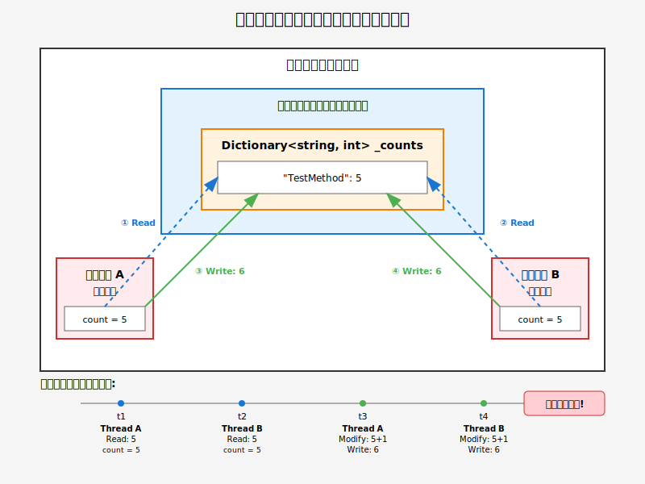
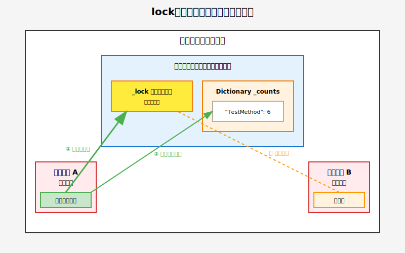
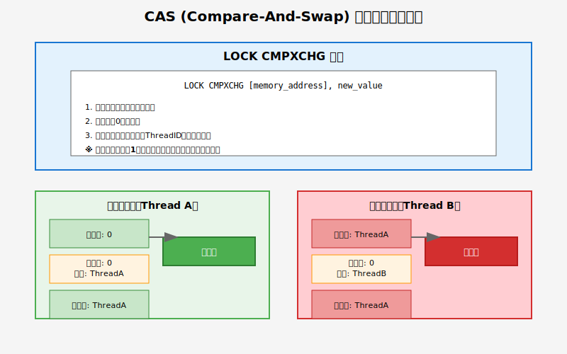
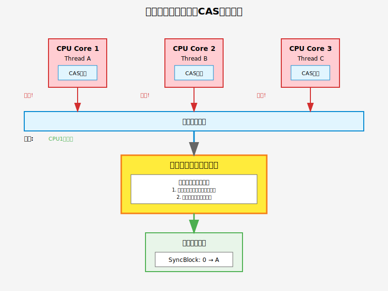
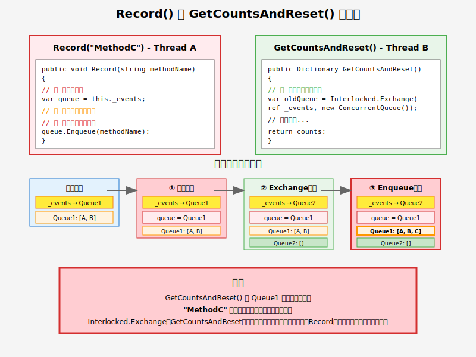

<!-- _class: lead -->

# マルチスレッド実装を理解する

### 正確性とパフォーマンスのバランス

<br>

**発表者：toutou ( **X**: [@__tou__tou](https://tx.com/__tou__tou) )**

<br>
<br>
<br>
<br>
<br>
<br>
<br>
<br>
<br>
<br>

<div style="position: absolute; bottom: 10px; left: 50%; transform: translateX(50%); font-size: 0.6em; color: #666; text-align: center; width: 80%;">
※ 本資料はAI（Claude）を活用して作成されています。<br>
技術的な内容については正確性に努めていますが、誤りが含まれる可能性があります。
</div>

<!-- 
speaker notes:
- マルチスレッド環境でのカウンター実装の課題について説明します
- 3つの実装方法を比較し、それぞれのトレードオフを解説します
-->

---
# デモやスライドのリンク

<br>

* **GitHub**: [multi-thread-demo](https://github.com/tou-tou/multi-thread-demo)
* 

---

# 概要

## 本発表の目的

マルチスレッド環境におけるカウンター実装の課題と解決策を検討する

## 対象システムの要件

- 秒間数千回のメソッド呼び出し
- 複数スレッドからの同時アクセス
- システム負荷の監視指標として使用

## 検討する実装方式

1. 非スレッドセーフ実装
2. Lock実装
3. Lock-Free実装

<!-- 
speaker notes:
- まずは素朴な実装から始めてみます
- 高頻度アクセスという要件が重要なポイントです
-->

---


<style scoped>
pre { font-size: 0.7em; }
li { font-size: 0.8em; }
h4 { font-size:0.8em;}
</style>


# 1. 非スレッドセーフ実装

```cs
public class MethodCounter_NotThreadSafe : IMethodCounter
{
    private Dictionary<string, int> _counts = new();

    public void Record(string methodName)
    {
        if (_counts.ContainsKey(methodName))
        {
            // 非アトミックなRead-Modify-Write処理
            // この3ステップは不可分ではないため、競合状態（Race Condition）を引き起こす。
            var count = _counts[methodName]; // 1. 読み込み (Read)
            count = count + 1;               // 2. 変更 (Modify)
            _counts[methodName] = count;     // 3. 書き込み (Write)
        }
        else
        {
            _counts[methodName] = 1;
        }
    }
}
```

#### 問題点：カウントアップがアトミック操作でないため、競合する可能性がある
* ケース1：マルチコアでの並列実行
  * コア1のスレッドAがメモリから値 `5` を読む。ほぼ同時に、コア2のスレッドBもメモリから値 `5` を読む。
  * 両方のスレッドがそれぞれ `5 + 1` を計算し、結果の `6` をメモリに書き戻そうとする。
* ケース2：シングルコアでの並行実行（コンテキストスイッチ）
  * スレッドAがメモリから値 `5` を読んだ直後、OSがスレッドBに処理を切り替える。
  * スレッドBが値 `5` を読み、計算し、`6` を書き戻す。
  * その後、処理が戻ってきたスレッドAは、最初に読んだ `5` を元に計算してしまい、再度 `6` を上書きしてしまう。


---

# 複数スレッドでカウント

<style scoped>
pre { font-size: 0.7em; }
</style>

```cs
static async Task Step1_ShowNotThreadSafe()
{
    var counter = new MethodCounter_NotThreadSafe();
    long exceptionCount = 0;

    // 100スレッドを同時に起動
    // Task.Run() で カウントタスク を ThreadPoolのスレッドで実行する
    var tasks = Enumerable.Range(0, ThreadCount).Select(_ => Task.Run(() =>
    {
        for (int i = 0; i < CallsPerThread; i++)
        {
            try
            {
                counter.Record("TestMethod");
            }
            catch
            {
                // 例外が発生したらカウント（Dictionary破損時など）
                Interlocked.Increment(ref exceptionCount);
            }
        }
    }));

    await Task.WhenAll(tasks);
}
```

---
<style scoped>
h2,h3 { font-size : 0.9em;}
li { font-size: 0.8em; }
section p {
  text-align: center;
}
</style>

# 結果：データ不整合

## テスト条件
- 100スレッド × 10,000回 = 合計100万回の呼び出し


## 発生した問題
- カウント値の不整合
- Dictionaryの内部構造破損による例外

---

<style scoped>
section p {
  text-align: center;
}
</style>

# 問題の原因（1/2）



---

<style scoped>
pre { font-size: 0.7em; }
h2,h3 { font-size : 0.7em;}
li { font-size: .8em; }
</style>

# 問題の原因（2/2）


```cs
public class MethodCounter_NotThreadSafe : IMethodCounter
{
    private Dictionary<string, int> _counts = new();

    public void Record(string methodName)
    {
        if (_counts.ContainsKey(methodName))
        {
            // 非アトミックなRead-Modify-Write処理
            // この3ステップは不可分ではないため、競合状態（Race Condition）を引き起こす。
            var count = _counts[methodName]; // 1. 読み込み (Read)
            count = count + 1;               // 2. 変更 (Modify)
            _counts[methodName] = count;     // 3. 書き込み (Write)
        }
        else
        {
            _counts[methodName] = 1;
        }
    }
}
```
### 技術的課題

1. **共有データへの非同期アクセス**
   - 全スレッドがヒープ上の単一Dictionaryオブジェクトを共有
   - 保護機構なしで同時読み書き

2. **Read-Modify-Write操作の非アトミック性**
   - `Record()`内での3つの個別操作
   - 操作間での割り込み発生によるカウント消失

<!-- 
speaker notes:
- Read-Modify-Write操作の非アトミック性が原因
- 実際の本番環境では予期しない例外でシステムダウンも
-->


---
<style scoped>
pre { font-size: 0.8em; }
h3 {font-size:0.8em;}
li {font-size:0.8em;}
</style>


# 2. Lock実装


```cs
public class MethodCounter_WithLock : IMethodCounter
{
    private readonly object _lock = new();
    private Dictionary<string, int> _counts = new();

    public void Record(string methodName)
    {
        lock (_lock) // 一度に1スレッドのみ実行
        {
            if (_counts.ContainsKey(methodName))
                _counts[methodName]++;
                // 以下と同等
                // var count = _counts[methodName]; // 1. 読み込み (Read)
                // count = count + 1;               // 2. 変更 (Modify)
                // _counts[methodName] = count;     // 3. 書き込み (Write)
            else
                _counts[methodName] = 1;
        }
    }
}
```

### ポイント
- **カウントが正確**: lockステートメント内の相互排他により、すべての操作が順序通りに実行される
  
---

# マルチスレッドでLock実装の検証

<style scoped>
pre { font-size: 0.7em; }
h3,li { font-size: 0.8em; }
</style>

```cs
static async Task Step2_ShowWithLock()
{
    var counter = new MethodCounter_WithLock();

    // 100スレッドを同時に起動（例外処理は不要）
    var tasks = Enumerable.Range(0, ThreadCount).Select(_ => Task.Run(() =>
    {
        for (int i = 0; i < CallsPerThread; i++)
        {
            counter.Record("TestMethod");
        }
    }));

    await Task.WhenAll(tasks);

    // 結果を表示（カウントは必ず正確）
    Console.WriteLine($"  -> 期待したカウント: {TotalCalls:N0}");
    Console.WriteLine($"  -> 実際のカウント:   {counter.GetCountsAndReset()["TestMethod"]:N0}");
    
    // 結論：'lock'を使えば、安全で正確なカウンターを簡単に実装できます
}
```

- 複数スレッドで書き込み、正しくカウントされるかを確認
  
---

<style scoped>
section p {
  text-align: center;
}
</style>

# Lock実装の結果


### 結果
- カウント値の完全な一致
- 例外の発生なし


<!-- 
speaker notes:
- 正確性は保証されたが、性能への影響が気になる
- 高頻度アクセスでは待機時間が累積する可能性
-->


---
<style scoped>
section p {
  text-align: center;
}
</style>

# lock の仕組み（1/2）





---

<style scoped>
section p {
  text-align: center;
}
</style>

# lock の仕組み（2/2）
- lockオブジェクトの取得は CPU レベルで「アトミック操作であること」が保証されている
- 単一の割り込み不可能なCPU命令「Compare-And-Swap (CAS) 」で実現される




---
<style scoped>
section p {
  text-align: center;
}
section img {
  width: 56%;
  height: auto; /* アスペクト比を維持 */
}
</style>

# lock取得の競合解決
- マルチコア（CPU）環境では、同時に CAS 命令を発行する可能性がある
- メモリコントローラーでメインメモリ上のlockオブジェクトを取得順がシリアライズされる




---
<style scoped>
/* このスライド専用のスタイルを定義 */
.center-heading {
  text-align: center; /* 水平方向の中央揃え */
  padding-top: 18%;  /* 上からの余白で垂直位置を調整 */
  font-size: 1.5em;    /* 文字を少し大きくする */
}
</style>

# Lock実装の懸念事項
<div class="center-heading ">
  スレッドの「lock取得の順番待ち」が<br>
  パフォーマンス低下につながる可能性
</div>

---

<style scoped>
pre { font-size: 0.8em; }
</style>

# [参考] Lock実装

```cs
public class MethodCounter_WithLock : IMethodCounter
    {
        private readonly object _lock = new();
        private Dictionary<string, int> _counts = new();

        public void Record(string methodName)
        {
            lock (_lock)  // ← スレッドが順番待ちでボトルネック
            {
                if (_counts.ContainsKey(methodName))
                    _counts[methodName]++;
                else
                    _counts[methodName] = 1;
            }
        }
        
        public Dictionary<string, int> GetCountsAndReset()
        {
            // 値を読み取るときに、保持しているカウントをリセットする
            // このため lock が必要
            lock (_lock)
            {
                var result = _counts;
                _counts = new Dictionary<string, int>();
                return result;
            }
        }
    }
```
---
<style scoped>
pre { font-size: 0.7em; }
</style>

# 3. Lock-Free実装

## `ConcurrentQueue<T>`を使った高速化


```cs
public class MethodCounter_LockFree : IMethodCounter
{
    private ConcurrentQueue<string> _events = new();
    
    public void Record(string methodName)
    {
        _events.Enqueue(methodName);  // lockなしで超高速！
        // 以下と同等
        //var currentQueue = _events;           // ステップ1: 参照をコピー
        //_events = new ConcurrentQueue<string>(); // ステップ2: 新しいキューを代入
    }
    
    public Dictionary<string, int> GetCountsAndReset()
    {
        // Interlocked.Exchange は全CPUコア間で同期してアトミックなキュー交換を実行する
        // GetCountsAndReset での一貫性は保証するが、Recordとの競合は防げない
        var currentQueue = Interlocked.Exchange(
            ref _events, new ConcurrentQueue<string>()
        );
        
        // Queueにたまった要素をメソッド毎に集計
        var counts = new Dictionary<string, int>();
        while (currentQueue.TryDequeue(out var methodName))
        {
            if (counts.ContainsKey(methodName))
                counts[methodName]++;
            else
                counts[methodName] = 1;
        }
        return counts;
    }
}
```

---
<style scoped>
pre { font-size: 0.45em; }
</style>


# Lock実装とLock-Free実装の比較

```cs
static async Task Step3_ComparePerformance()
{
    const int durationSeconds = 3;

    // --- Lock版のテスト ---
    // テスト前にGCを実行し、メモリ状態をクリーンにする
    GC.Collect();
    GC.WaitForPendingFinalizers();
    await Task.Delay(200); // 安定待ち

    var lockCounter = new MethodCounter_WithLock();
    long lockWrites = await RunWriteOnlyTest(lockCounter, durationSeconds);
    Console.WriteLine($"  -> ✅ Lock版:      {lockWrites / durationSeconds,15:N0} 件/秒");

    // --- Lock-free版のテスト ---
    GC.Collect();
    GC.WaitForPendingFinalizers();
    await Task.Delay(200);

    var lockFreeCounter = new MethodCounter_LockFree();
    long lockFreeWrites = await RunWriteOnlyTest(lockFreeCounter, durationSeconds);
    Console.WriteLine($"  -> ⚡ Lock-free版: {lockFreeWrites / durationSeconds,15:N0} 件/秒");

    double speedup = (double)lockFreeWrites / lockWrites;
    Console.WriteLine($"\n  [結論] Lock-Free版はLock版の約{speedup:F2}倍高速！");
}

// RunWriteOnlyTestヘルパーメソッド
static async Task<long> RunWriteOnlyTest(IMethodCounter counter, int durationSeconds)
{
    long totalWritten = 0;
    var cts = new CancellationTokenSource();
    var keys = Enumerable.Range(0, 100).Select(i => $"Method_{i}").ToArray();
    
    var writerTasks = Enumerable.Range(0, 100)
        .Select(threadIndex => Task.Run(() =>
        {
            var random = new Random(threadIndex);
            while (!cts.IsCancellationRequested)
            {
                counter.Record(keys[random.Next(keys.Length)]);
                Interlocked.Increment(ref totalWritten);
            }
        })).ToList();
    
    await Task.Delay(TimeSpan.FromSeconds(durationSeconds));
    cts.Cancel();
    await Task.WhenAll(writerTasks);
    return totalWritten;
}
```
---
<style scoped>
section p {
  text-align: center;
}
section img {
  width:80%;
  height: auto; /* アスペクト比を維持 */
}
</style>

# Lock実装とLock-Free実装の性能比較


- Thread待機時間が減ってパフォーマンス向上

<!-- 
speaker notes:
- Lock-free実装により大幅な性能向上を実現
- しかし、本当に完璧なのでしょうか？
-->

---
<style scoped>
pre { font-size: 0.6em; }
</style>

# Lock-Free実装の課題: 大量の同時読み書きシナリオ


```cs
    static async Task Step4_ShowLockFreeDataLoss()
    {

        var counter = new MethodCounter_LockFree();
        //var counter = new MethodCounter_WithLock(); // Lock版
        long totalWritten = 0;
        long totalRead = 0;
        var cts = new CancellationTokenSource();

        // 大量書き込み
        var writerTasks = Enumerable.Range(0, ThreadCount).Select(_ => Task.Run(() =>
        {
            while (!cts.IsCancellationRequested)
            {
                counter.Record("Event");
                Interlocked.Increment(ref totalWritten);
            }
        })).ToList(); // タスクを開始させる（Enumerableのままだと遅延実行になってしまう）

        // 大量読み出し（リセットによる書き込みも含む）
        var readerTask = Task.Run(async () =>
        {
            while (!cts.IsCancellationRequested)
            {
                var c = counter.GetCountsAndReset();
                Interlocked.Add(ref totalRead, c.Values.Sum());
                await Task.Delay(1);
            }
        });

        await Task.Delay(10000); // 10秒間テスト
        cts.Cancel();
        await Task.WhenAll(writerTasks.Append(readerTask));
        totalRead += counter.GetCountsAndReset().Values.Sum(); // 残りを回収

        Console.WriteLine($"  -> 書き込み総数: {totalWritten:N0}");
        Console.WriteLine($"  -> 読み取り総数: {totalRead:N0}");
        Console.ForegroundColor = ConsoleColor.Red;
        Console.WriteLine($"  -> ロストした数: {totalWritten - totalRead:N0}");
        Console.WriteLine("\n  [結論] わずかですが、データがロストしてしまいました！\n");
        Console.ResetColor();
    }
```

---
<style scoped>
section p {
  text-align: center;
}
section img {
  width:80%;
  height: auto; /* アスペクト比を維持 */
}
</style>
# Lock-Free実装の大量同時書き込み結果


## 結果
- わずかにデータロスト発生

---
<style scoped>
section p {
  text-align: center;
}
section img {
  width:70%;
  height: auto; /* アスペクト比を維持 */
}
</style>
# データロストの理由



---
# まとめ：3つの実装の比較

<style scoped>
table { 
  font-size: 1.0em;
  width: 95%;
}
th, td { 
  padding: 8px;
  text-align: center;
  font-size: 1.0em;
}
</style>
    
<br>
<br>
      


| 実装方式 | 正確性 | 性能 | 適用場面 |
|:---------|:------:|:----:|:--------|
| **NotThreadSafe** | ❌ | － | なし |
| **WithLock** | ✅ | ⚠️ | 正確性が最優先<br><span class="small">（課金、在庫管理とか）</span> |
| **LockFree** | ⚠️ | ✅ | 高速性が重要<br><span class="small">（アクセス解析、ログとか）</span> |

- 要件に応じて実装を使い分けよう


---

# その他・検証したかったこと

- メモリバリアとvolatile
  - **Read Barrier**: 読み込み順序保証
  - **Write Barrier**: 書き込み順序保証  
  - **Full Barrier**: 両方保証（lock, Interlocked）
  -  volatile は順序保証のみ、アトミック性は保証しない
- 同期プリミティブの使い分け
  - **lock**: 一般的な相互排他
  - **ReaderWriterLockSlim**: 読み取り頻度が >> 書き込み頻度 の場合
  - **SemaphoreSlim**: 同時アクセス数制限
- パフォーマンス考慮したlockの使い分け
  - **読み書き比率**: 7:1以上なら ReaderWriterLockSlim
  - **待機時間**: 短時間=SpinLock、長時間=通常lock
  - **スケーラビリティ**: 高負荷時はlock-freeデータ構造
- ベンチマーク実装に BenchmarkDotNet を使う


<!-- 
speaker notes:
- 実際のシステムでは要件に応じて使い分けが必要
- パフォーマンステストは必須
- 将来の保守性も考慮すること
-->


---


### リンク

<br>

**GitHub**: [multi-thread-demo](https://github.com/tou-tou/multi-thread-demo)
**X**: [@__tou__tou](https://tx.com/__tou__tou)